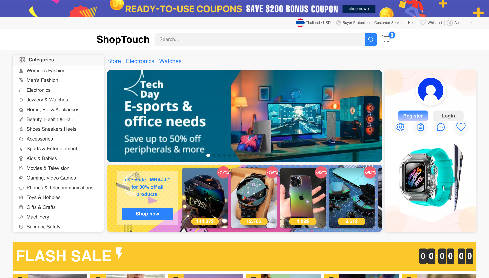

# ShopTouch E-Commerce Web application

A project I'm proud of is the ShopTouch web application. I was the lead developer on this project, responsible for both the frontend and backend development. I built a full-stack e-commerce platform using Next.js for server-side rendering and API routes, Redux Toolkit for efficient state management, and MongoDB as the database for storing product, user, and order data. The platform includes a user-friendly interface for browsing and purchasing products, as well as an admin dashboard for managing products, orders, and user accounts

## tech stack
-  react js, next js, mongodb, redux toolkit and next auth